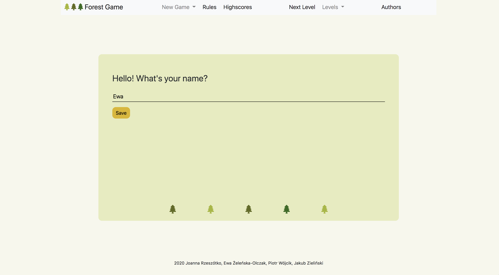
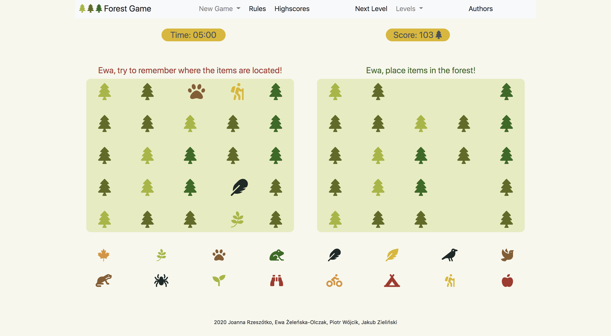

# Freestyle JavaScript Game

## Story

By now you know the Javascript basics. Lets put it to a test and create something awesome, creative and motivating. The goal is to create a game in the browser. What type of game?

Wait for it...

Any type :) Just your creativity (and your JavaScript knowledge) can limit the result.

## What are you going to learn?

- finding DOM elements in the document tree
- DOM manipulation using JavaScript
- handling user interactions with JavaScript event handlers
- HTML data attributes
- CSS styling

## Tasks

1. As a team you should figure out what game you want to work on and what features you want to finish.
    - There is a game that the whole team agrees you would like to implement
    - Checked your game idea with a mentor to make sure it can be realistically implemented in a sprint
    - There is a backlog of possible features you have collected that the game can have
    - There is a plan based on story estimations what you can finish by the end of the sprint

2. We want to have a playable game based on JavaScript DOM manipulation and event handling
    - The game is based on handling some kind of event(s) (mouse, keyboard...)
    - The game mainly relies on DOM manipulation to move elements around on the screen or change their appearance (beside CSS of course)
    - The code is separated into several javascript functions

3. [OPTIONAL] The game or parts of it can be time driven. This adds some complexity as you have to change things around in given time intervals
    - There is a part of the game that changes over time without any interaction (eg. moving enemy/avatar)

4. [OPTIONAL] There should be a way to check my highest score.
    - The highscore data is stored between games

## General requirements

None

## Hints

- Have fun, create a game that is motivating for you! :)
- How to figure out what game and features to implement? Here are some ideas:
    - have a brainstorming session, throw in game/feature ideas without criticizing each other, any idea is a good idea, write them down somewhere
    - after you are finished talk about what you have collected and decide on a game
    - **now talk with a mentor about the idea and if it can be realistically implemented in a sprint**
    - collect any feature ideas you have and specify them so every team member knows what the expectations are with it (these are your [user stories](https://www.mountaingoatsoftware.com/agile/user-stories) in your backlog)
    - now estimate each user story and figure out how many you can finish in this sprint
- If you search the internet for javascript games, you'll see lots of solutions using [canvas](https://developer.mozilla.org/en-US/docs/Web/API/Canvas_API). It is a nice technology, but we have not met canvas and the main focus of this project is to practice DOM and event handling, so please **say no to canvas for this project**. Later on feel free to learn about canvas with a pet project game for example.
- You can open the `index.html` by starting a small HTTP server
(see the background materials for details)
- You can decide to create some backend functionality. For that, use any previously learnt technology (eg. Flask).
- Don't forget to use git branches as you develop new features

## Starting your project

## Background materials

- <i class="far fa-exclamation"></i> [Javascript - Events](/pages/javascript/javascript-events)
- <i class="far fa-exclamation"></i> [Javascript - DOM manipulation](/pages/javascript/javascript-dom)
- <i class="far fa-exclamation"></i> [Javascript - Extending the DOM](/pages/javascript/javascript-extending-the-dom)
- <i class="far fa-exclamation"></i> [How to start a local HTTP server](/pages/tools/serve-files)
- [Javascript - Debugging](/pages/javascript/javascript-debugging)
- [Javascript - Other features](/pages/javascript/javascript-other-features)
- [Javascript.info tutorial](https://javascript.info/)
- [MDN HTML Drag&Drop API](https://developer.mozilla.org/en-US/docs/Web/API/HTML_Drag_and_Drop_API)
- [MDN Drag operations documentation](https://developer.mozilla.org/en-US/docs/Web/API/HTML_Drag_and_Drop_API/Drag_operations)
- <i class="far fa-book-open"></i> [CSS Flexbox guide](https://css-tricks.com/snippets/css/a-guide-to-flexbox/)
- <i class="far fa-book-open"></i> [CSS Grid guide](https://css-tricks.com/snippets/css/complete-guide-grid/)
